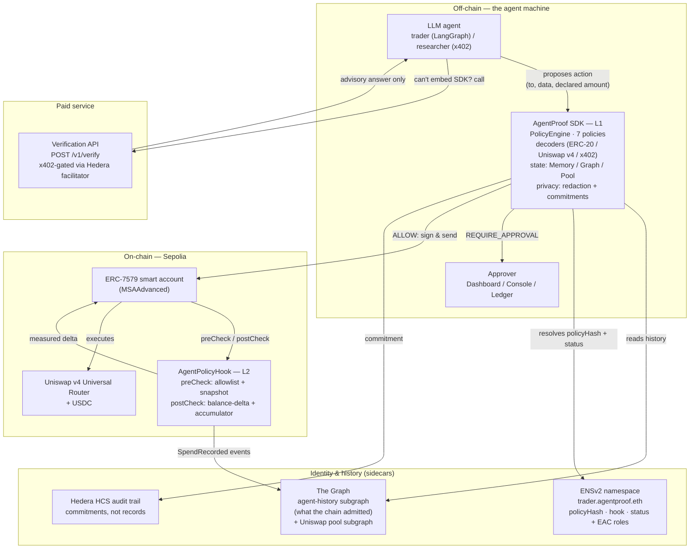

# AgentProof

**A safety runtime for autonomous agents. Trust the agent to decide; don't trust it to enforce its own limits.**

Give an AI agent a wallet and it will eventually do something its owner never intended — misread a price, follow a poisoned instruction, or get its helper code bypassed entirely. AgentProof is the boundary that stops that from becoming lost funds. Every action the agent proposes is checked against an explicit, owner-written policy in two independent places: a rich off-chain check that gives good answers, and an on-chain check that cannot be skipped.

> If you read nothing else: the SDK gives good decisions, the smart-contract hook gives guarantees. The demo's key moment is an action that skips the SDK completely and still gets stopped by the hook.

---

## Contents

1. [What this is, in plain English](#1-what-this-is-in-plain-english)
2. [A concrete example](#2-a-concrete-example)
3. [Architecture](#3-architecture)
4. [What AgentProof can do](#4-what-agentproof-can-do-the-seven-policies)
5. [Scope: what is and isn't covered](#5-scope-what-is-and-isnt-covered)
6. [How one transaction flows](#6-how-one-transaction-flows-end-to-end)
7. [Sponsor integrations](#7-sponsor-integrations)
8. [The one idea everything rests on: provenance](#8-the-one-idea-everything-rests-on-provenance)
9. [Threat model (summary)](#9-threat-model-summary)
10. [What is proven, fuzzed, or neither](#10-what-is-proven-what-is-fuzzed-what-is-neither)
11. [Quick start](#11-quick-start)
12. [Using the SDK](#12-using-the-sdk)
13. [Repository layout](#13-repository-layout)
14. [Future work](#14-future-work)
15. [Submission checklist](#15-submission-checklist)
16. [Licence](#16-licence)

---

## 1. What this is, in plain English

An autonomous trading or research agent is a language model with the ability to move money. Today, "safety" for such agents almost always means a wrapper: code that looks at what the agent *says* it wants to do and refuses the bad ones. That works until the moment it matters, because the thing being constrained is the same process doing the constraining:

- A **hallucinating** agent proposes a 250 USDC swap under a 100 USDC limit.
- A **prompt-injected** agent reads "transfer everything to 0xattacker" from token metadata and asks "nicely".
- A **compromised** agent process skips the safety wrapper and signs directly.

AgentProof splits the job into two layers that fail independently:

| Layer | Where it lives | What it knows | What it is trusted for |
|---|---|---|---|
| **L1 — SDK** (`@agentproof/sdk`) | Off-chain, in the agent's process | 7 policy types, historical spend, can ask a human | Good decisions, rich reasons, UX. **Bypassable by design — and we assume it will be.** |
| **L2 — hook** (`AgentPolicyHook.sol`) | On-chain, inside the agent's smart account (ERC-7579) | 2 invariants + an allowlist | The actual limits. **Unbypassable** short of the owner key uninstalling it. |

An analogy: the SDK is the responsible co-pilot who reads the map and warns you. The hook is the guardrail on the mountain road. You want both, but only one of them works when the driver is asleep.

The test that makes this real is `contracts/test/integration/RealAccount.t.sol`:

```solidity
function test_RejectsUserOpThatBypassesTheSdkEntirely() public { … }
```

No SDK is involved anywhere in that test. The hook is installed on the **ERC-7579 reference account** (MSAAdvanced) and driven with real `PackedUserOperation`s through a real EntryPoint v0.8. The EntryPoint accepts a validly-signed operation, the account refuses it, and no funds move.

That suite exists because the mock-only version of it hid a real bug for weeks: `postCheck` took `(bytes, bool, bytes)` — a *draft* ERC-7579 signature — while every shipped account calls `postCheck(bytes)`. The hook would have installed cleanly and reverted on first execution. The mocks agreed with each other while both disagreed with reality.

---

## 2. A concrete example

Owner writes one policy file (`agent.policy.json`): max 100 USDC per transaction, max 500 USDC per day, keep at least 10 USDC in reserve, only talk to these two contracts, only send to this treasury, ask a human above 100 USDC.

The agent then tries, in order:

1. Swap 80 USDC on the allowlisted router → **ALLOW** (under every limit).
2. Swap 250 USDC → **BLOCK** (over the per-transaction ceiling).
3. Transfer to an attacker address from poisoned context → **BLOCK** (not an allowlisted recipient — caught at both layers).
4. Approve `type(uint256).max` to "spend later" → **BLOCK** (an unlimited approval's worst case is unbounded).
5. Twenty small transfers to dodge the per-transaction cap → **BLOCK on the 13th** (daily accumulator catches salami-slicing).
6. A 90 USDC swap → **REQUIRE_APPROVAL** (pauses; a human confirms on the dashboard or a Ledger).
7. Sign a transaction **skipping the SDK entirely** → **reverts on-chain** (the hook never knew the SDK existed).

Run it yourself with `pnpm demo` — no keys, no RPC, no deployment needed. The bypass in step 7 reverts for real, because the revert comes from the enforcement path of the in-process account model, not from a check we chose to skip.

---

## 3. Architecture

### 3a. System overview



In words:

- **The agent proposes, it never enforces.** The LLM outputs an intent (target contract, calldata, declared amount).
- **L1 decides.** The SDK decodes the calldata into a worst-case outflow, evaluates all 7 policies against current state (balances, daily spend from The Graph reconciled with the chain), and returns `ALLOW`, `BLOCK`, or `REQUIRE_APPROVAL` with per-policy reasons.
- **A human can be in the loop.** `REQUIRE_APPROVAL` routes to the dashboard, console, or Ledger device, which signs the human-readable intent (recipient, asset, amount), never raw calldata.
- **L2 enforces.** The ERC-7579 account calls the hook's `preCheck` before execution (allowlist check + balance snapshot) and `postCheck` after (measure what actually left, update the daily accumulator, revert if a limit broke). The hook never reads a declared amount.
- **Identity and history are external.** ENSv2 binds the agent's name to its policy hash, hook address, and status with role separation (owner can repoint policy, agent can only suspend itself). The Graph indexes the hook's own events so history reflects what the chain admitted. Hedera HCS stores audit commitments (hashes, not amounts).
- **The paid API is advisory.** Agents that cannot embed the SDK can call `POST /v1/verify` (x402-gated, pay-per-call on Hedera). Its answers are L1 only — the on-chain hook is the boundary, and every API response says so.

### 3b. Component map

| Component | Path | Role |
|---|---|---|
| SDK (the product) | `packages/sdk/` — zero runtime deps | Policy engine, 7 policies, decoders, ENS/The Graph/Hedera clients, simulated account for tests |
| Hook + library | `contracts/src/AgentPolicyHook.sol`, `contracts/src/lib/PolicyLib.sol` | On-chain enforcement of the critical subset |
| Identity | `contracts/src/AgentSubnameRegistrar.sol`, `packages/sdk/src/identity/` | ENSv2 subnames + hash-bound startup check |
| Verification API | `packages/api/` — `node:http`, no framework | x402-gated `POST /v1/verify`, streams runs to the dashboard |
| Payment client | `packages/x402-client/` | Pays for verification, policy-checks its own payment first (the loop closes) |
| Agents | `apps/agents/trader`, `apps/agents/researcher` | Demo consumers of the SDK |
| Dashboard | `apps/dashboard/` (Next.js) | Read-only control plane + approval UI + proof drawer |
| Subgraph | `subgraphs/agent-history/` | Indexes `SpendRecorded` events |
| Recipes | `recipes/verify-before-you-swap.ts` | Gateway integration that imports nothing internal |

Two rules: `deployments/*.json` is the single source of truth for addresses, and `proofs/*.json` is generated by `pnpm verify:formal`, never hand-edited.

---

## 4. What AgentProof can do — the seven policies

All seven run in the SDK (L1). The two marked ★ are additionally enforced by the hook (L2) on measured on-chain state.

| # | Policy | In human terms | Layer |
|---|---|---|---|
| P1 ★ | `maxTransaction` | "No single action may move more than X." Stops fat-finger and hallucinated amounts. | SDK + hook |
| P2 ★ | `dailySpend` | "No more than Y per day, total." Stops salami-slicing (many small transfers under the per-tx cap). UTC-day buckets. | SDK + hook |
| P3 | `allowedContracts` | "Only talk to these contracts." The anti-prompt-injection control: a poisoned instruction pointing at an unknown contract dies here. | SDK + hook (target check) |
| P4 | `allowedRecipients` | "Only send value to these addresses." Catches the subtle case: for an ERC-20 transfer the *target* is the (allowlisted) token, so the hook also checks the *counterparty* decoded from calldata. | SDK + hook (counterparty check) |
| P5 | `minBalance` | "Never leave the wallet with less than Z." Enforced in `postCheck` on the real post-execution balance. | SDK (estimate) + hook |
| P6 | `approvalThreshold` | "Anything at/above T needs a human." Never rescues a BLOCK — only upgrades a pass to `REQUIRE_APPROVAL`. On-chain, over-threshold just reverts; the approval path re-signs with the owner key at a raised ceiling. | SDK (+ owner-key path) |
| P7 | `poolLiquidity` | "Don't swap into a pool too thin to trade in." Reads the deepest Uniswap pool from a public subgraph. Bounding *spend* and bounding *loss* are different problems — 80 USDC of outflow is 80 USDC whether it buys something or dust. Advisory-only, no on-chain counterpart, by construction. | SDK only |

Unknown calldata (`UNKNOWN` — no decoder claims it) is blocked. Refusing to decide on bytes you cannot read is the whole discipline; a decoder that guesses produces a number that looks authoritative and is worse than no decoder.

---

## 5. Scope: what is and isn't covered

### In scope (what AgentProof handles)

- Hallucinated oversized actions (P1), salami-slicing across many small actions (P2), prompt-injection pointing at attacker contracts/recipients (P3/P4), approvals whose worst case exceeds limits (P1 applied to allowances), reserve draining (P5), high-value actions needing human sign-off (P6), and swaps into empty venues (P7).
- **SDK bypass**: a compromised agent that signs directly without calling the SDK is still stopped by the hook. This is the core claim and it has a dedicated integration test plus a demo step.
- **Value hidden in calldata**: the hook measures balance deltas, never declared amounts.

### Out of scope / explicitly not defended (said out loud)

- **A compromised owner key.** Owner ≠ agent by design. If the owner key is taken, policy can be rewritten and the module removed.
- **Verifying the LLM itself.** Impossible and not claimed. We verify the deterministic boundary around it.
- **Slippage and MEV.** We bound *spend*, not execution quality. A swap inside every limit can still be a bad trade.
- **A proof proves only the spec we wrote, under the model checked.** `UNPROVEN` is reported as such, never as success.

### Accepted risks and known gaps (documented, not hidden)

1. `delegatecall` and batch executions **revert** — safe but blunt; a legitimate batch is blocked. (`ExecutionLib` refuses them; analysing composed outflow is future work.)
2. Only the **configured asset** (USDC) is tracked on-chain. A swap spending WETH is bounded by the allowlist, not by a value limit. Mitigated in the demo config (single asset, single router, no batching).
3. **Cross-UserOp approval draining** by an allowlisted spender (approve now, drain next block) is out of scope; the daily accumulator only catches it when funds move.
4. **UTC-day boundary gaming (T6)**: two daily limits a minute apart across midnight. Accepted, tested, shown in the demo — a rolling 24h window is future work.
5. Multi-hop v4 swaps and unknown third-party router commands decode as `UNBOUNDED` → block/escalate (conservative, can be noisy on exotic routers).

Full versions: `docs/threat-model.md`, `docs/future-work.md`, `docs/privacy.md`, `docs/formal-verification.md`.

---

## 6. How one transaction flows, end to end

```mermaid
sequenceDiagram
    participant Agent as LLM agent
    participant L1 as SDK (L1 decide)
    participant Human as Dashboard / Ledger
    participant Acc as ERC-7579 account
    participant L2 as Hook (L2 enforce)
    participant DEX as Uniswap router

    Agent->>L1: propose(to, calldata, declaredAmount)
    L1->>L1: decode calldata → worst-case outflow (DECODED)
    L1->>L1: evaluate 7 policies (allowlist → limits → approval)
    alt BLOCK
        L1-->>Agent: BLOCK + reason + violations
    else REQUIRE_APPROVAL
        L1->>Human: human-readable intent (recipient, asset, amount)
        Human-->>L1: approve / reject (Ledger signs intent, not bytes)
        alt rejected
            L1-->>Agent: BLOCK (denied by approver)
        end
    end
    L1->>Acc: sign & submit UserOp (bundler → EntryPoint; strict 7579 accounts reject direct EOA calls)
    Acc->>L2: preCheck — allowlist? snapshot balance → hookData
    alt target not allowlisted
        L2-->>Acc: revert (cheap, before state changes)
    end
    Acc->>DEX: execute call
    DEX-->>Acc: return
    Acc->>L2: postCheck — measure delta (MEASURED), applySpend
    alt over maxTransaction / dailyLimit / below minBalance
        L2-->>Acc: revert (nothing moved)
    else ok
        L2->>L2: emit SpendRecorded, update accumulator
        Acc-->>Agent: success receipt
    end
```

Startup has its own binding check (`createAgentProof` is async for a reason): validate the policy, compare its hash against the ENS record **and** the hook's stored hash, check the agent isn't suspended, refuse to run with no hook installed. Any mismatch throws. Without a `ChainReader` the SDK logs that the binding was **not** verified rather than quietly checking two legs and calling it three.

Reads and writes are deliberately asymmetric: every read the engine needs is an `eth_call` done with `fetch` and **zero dependencies** (no supply chain in the decision path). Signing uses viem, dynamically imported as an optional peer dep — you only pay for a wallet stack if you sign.

---

## 7. Sponsor integrations

Six, each load-bearing rather than decorative. What is *built* vs *qualified* (needs external accounts/hardware/hosting) is tracked per-integration in `docs/future-work.md`.

- **ENS v2 — agents as namespaces.** `trader.agentproof.eth` maps `addr → smart account`, `text agentproof.policy → policyHash`, `text agentproof.hook → hook address`, `text agentproof.status → active|suspended`. EAC roles encode the trust split: owner holds `ROLE_SET_POLICY_RECORD` (only a human repoints policy), agent session key holds only `ROLE_SET_STATUS_RECORD` (may suspend itself, nothing else). Tested: agent key cannot widen its own policy, owner key can, agent key may suspend itself.
- **The Graph — history that decides.** `subgraphs/agent-history/` indexes the hook's `SpendRecorded` events (what the chain *admitted*, not what was intended). Indexer lag is reconciled against the on-chain accumulator — **whichever source permits less wins**; if both are unreachable the SDK fails closed. A second public subgraph feeds `PoolLiquidityPolicy` (is the venue real?).
- **Hedera — the verification service is the paid product.** `POST /v1/verify` returns 402 with `{ asset: USDC (HTS), amount: 0.01, network: hedera-testnet }`; the client partially signs, retries with `X-PAYMENT`; the facilitator settles (paying gas); then `200 { decision, reason, violations, proof }`. **Verify before work, settle after** — callers are never charged for failed requests. The loop closes: an agent pays, under policy, for a verification, and the payment is policy-checked first. Framing warning: the HTTP endpoint alone is advisory L1; the boundary is the hook.
- **Uniswap — making v4 calldata policy-checkable.** `packages/sdk/src/decode/uniswapV4.ts` (also exported standalone as `@agentproof/sdk/decode/uniswap`) decodes a Universal Router command stream to worst-case outflow per currency: exact-output binds on `amountInMaximum` (never the quote), amounts attributed to the currency that leaves, anything undecodable → `UNBOUNDED`. Pinned against six real Sepolia transactions in `tests/fixtures/uniswap-sepolia.json` (each naming its hash). The first run decoded all six as `UNBOUNDED` — off-by-one action bytes, wrong struct word, wrong command mask — invisible until real calldata replaced self-encoded fixtures.
- **Ledger — the human in the loop.** `REQUIRE_APPROVAL` routes to a device via `selectApprover`. If `LEDGER_APPROVAL_ENABLED` is on and no device is reachable, the process **refuses to start** rather than downgrading to a browser click — silently swapping hardware confirmation for a click is a trust-model change, not an error-handler decision.
- **Bazantic — verify before you swap.** `recipes/verify-before-you-swap.ts` chains quote → `/v1/decode` → `/v1/verify` → execute-or-stop over plain HTTP, importing nothing internal. Failing to *obtain* a verification stops the swap like a BLOCK. See `docs/integrations/bazantic.md`.

Privacy (implemented in `packages/sdk/src/privacy/`, not promised here): evaluate locally (zero-dep in-process engine); log shapes not values (redaction on the way *in*); publish commitments not records (`keccak256(salt ‖ account ‖ intent ‖ decision)` on HCS); bucket public amounts (order-of-magnitude bands). See `docs/privacy.md`.

---

## 8. The one idea everything rests on: provenance

A limit is meaningless unless the number it compares against is derived from the transaction itself. Every amount carries a tag:

| Provenance | Meaning | Trusted? |
|---|---|---|
| `DECLARED` | the agent said so | never |
| `DECODED` | parsed from calldata by a known-selector decoder | for allowlisted shapes |
| `MEASURED` | balance delta across execution | authoritative |

L1 decides on `DECODED`. L2 enforces on `MEASURED`. Two consequences: an approval's worst case is the **entire allowance** (unlimited ⇒ unbounded ⇒ always blocks), and an exact-output swap binds on **`amountInMaximum`**, never the quote.

---

## 9. Threat model (summary)

Full version in `docs/threat-model.md`.

| # | Adversary | Defended by | Layer |
|---|---|---|---|
| T1 | Hallucinating agent | policy engine | SDK |
| T2 | Prompt-injected agent | recipient/contract allowlist (+ counterparty check) | SDK + hook |
| T3 | SDK bypass | `preCheck`/`postCheck` on the account | on-chain |
| T4 | Value hidden in calldata | calldata decoding + balance-delta check | on-chain |
| T5 | Salami slicing | daily cumulative accumulator | SDK + hook |
| T6 | UTC-day boundary gaming | **accepted**, documented, not fixed | — |
| T7 | Policy tampering by the agent | ENS EAC roles + owner-only writes + 3-way hash binding | identity + startup |
| T8 | Malicious module uninstall | requires the owner validator | account config |

Known gaps (with one-line mitigations in the demo config: single asset, single router, no batching): see §5.

---

## 10. What is proven, what is fuzzed, what is neither

The honest core of the project — stated precisely.

| Claim | Method | Status |
|---|---|---|
| `MAX_TRANSFER`, `DAILY_SPEND` over `PolicyLib` | solc SMTChecker, CHC engine | see `proofs/summary.json` (committed, with raw transcripts in `artifacts/smt/`) |
| The hook itself | Foundry invariant campaign | fuzzed, **not** proven |
| Decoders | round-trip + captured Sepolia calldata | tested |
| L1 engine vs L2 semantics | differential fuzz, 4,000 sequences | tested, zero disagreements |

The proof artifacts are committed and generated by `pnpm verify:formal`, never hand-edited. Fresh checkout without them → SDK reports `NOT_RUN`, demo says so on screen. It never reports `PROVEN` for a proof it doesn't have (the parser requires positive evidence before writing that status).

We verify a library, not the hook, for a technical reason: CHC loses precision on external calls, `delegatecall`, and cross-contract mappings — exactly what a 7579 hook is full of. `PolicyLib.evaluate` is a total, scalar-typed, non-reverting core (verified); `applySpend` is the reverting adapter (not verified, not claimed). The negative control (`PolicySpecBroken.sol`, off-by-one + missing reset) **must** produce a counterexample — CI fails if it verifies cleanly, because a checker that passes broken code makes every `PROVEN` decoration.

A proof only proves the specification we wrote, under the model checked.

---

## 11. Quick start

Requirements: Node ≥ 22.6, pnpm 9. Optional: Foundry (contracts), solc 0.8.28 + z3 (formal verification).

```bash
pnpm install
pnpm demo          # the full demo, offline, no keys required
pnpm test          # 155 tests (105 SDK + 50 API), incl. differential fuzz over 4,000 sequences
pnpm contracts:test    # 32 Foundry tests, incl. Gate G1 against a real 7579 account
pnpm verify:formal     # SMTChecker: MAX_TRANSFER + DAILY_SPEND, plus the negative control
```

The demo runs against `SimulatedAccount`, an in-process model of the account and hook. For the dashboard, run the API and UI side by side:

```bash
AGENTPROOF_ADMIN_TOKEN=… pnpm api    # :8402  the Verification API
pnpm dashboard                        # :3000  the Next.js control plane
```

The dashboard proxies the API through a Next rewrite (same-origin cookie, no CORS negotiation). The approval step pauses in the demo terminal — approve there and the dashboard card updates. `AGENTPROOF_AUTO_APPROVE=true` for hands-free, `AGENTPROOF_DASHBOARD=off` to skip streaming.

Against real Sepolia (identical steps — same policy file, same bypass, same revert):

```bash
AGENTPROOF_LIVE=true SEPOLIA_RPC_URL=… BUNDLER_URL=… AGENT_SESSION_KEY=… SMART_ACCOUNT_ADDRESS=… pnpm demo
```

Incomplete config falls back to the simulator *loudly*. A demo that silently degrades to fake transactions is worse than one that says it is simulated.

Supporting commands: `pnpm verify:deployment` (bytecode + activity check over `deployments/`), `pnpm capture:uniswap-fixtures` (refresh Sepolia decoder fixtures), `pnpm recipe:verify-before-you-swap`. See `docs/quickstart.md` and `docs/integrations/bazantic.md`.

---

## 12. Using the SDK

```ts
import { createAgentProof, ENSIdentity, GraphStateProvider } from '@agentproof/sdk';

const chain = new JsonRpcChainReader({ url: process.env.SEPOLIA_RPC_URL!, chainId: 11155111 });

const proof = await createAgentProof({
  policy: './agent.policy.json',
  identity: new ENSIdentity({ chain, universalResolver }),
  state: new GraphStateProvider({ endpoint, apiKey, hook, chain }),
  enforcement: {
    executor: new EoaExecutor({ account, agentSigner }),
    chain,   // enables the third leg of the hash binding
  },
});

const account = await proof.protect();
const result = await account.execute(action);   // ALLOW | BLOCK | REQUIRE_APPROVAL
```

Two executors, same enforcement (the hook runs inside the account's execution path either way): `BundlerExecutor` (real ERC-4337 UserOperations through the EntryPoint — the live path, proven on Sepolia via Pimlico, including validator-keyed nonces) and `EoaExecutor` (direct `account.execute()` calls — works against permissive/test accounts, reverts with `AccountAccessUnauthorized` on strict ERC-7579 accounts like the pinned MSAAdvanced).

Writing a policy (`agent.policy.json`): amounts are base-unit integer strings (`"100000000"` = 100 USDC at 6 decimals). Validation fails loudly at startup — daily below per-tx limit, unreachable approval threshold, or empty allowlist all throw rather than producing an agent that can do nothing or everything.

---

## 13. Repository layout

```
packages/sdk/          @agentproof/sdk — the product. Zero runtime dependencies.
  src/adapters/        JsonRpcChainReader (zero-dep reads), EoaExecutor, BundlerExecutor, viem signer
  src/core/            PolicyEngine, AgentProof, policy parsing + canonical hash
  src/policies/        the seven policies (maxTransaction, dailySpend, allowlist×2, minBalance, approvalThreshold, poolLiquidity)
  src/decode/          erc20, uniswapV4, x402, native, registry
  src/identity/        ENSIdentity (ENSv2, Universal Resolver)
  src/state/           Memory, Graph and Uniswap-pool state providers
  src/approval/        Console, Dashboard, Ledger approvers + selectApprover
  src/privacy/         redaction, commitments, public-record projection
  src/ports/           every external system, behind one interface
  src/testing/         SimulatedAccount — faithful in-process model of the hook
  tests/fixtures/      real Sepolia calldata, each entry naming its tx hash
packages/api/          the Verification API, x402-gated, node:http, no framework
packages/x402-client/  payment client that policy-checks its own payments
apps/dashboard/        Next.js split-pane control plane. Reads only, bar approval.
apps/agents/           trader (LangGraph) and researcher (x402)
contracts/             AgentPolicyHook, PolicyLib, AgentSubnameRegistrar
  formal/              PolicySpec (proves) + PolicySpecBroken (must not)
  test/integration/    Gate G1: the hook on a real 7579 account + EntryPoint
  lib/                 pinned deps, gitignored — CI reinstalls them
subgraphs/             agent-history: the hook's events, indexed
recipes/               verify-before-you-swap, for gateways and other runtimes
proofs/ artifacts/smt/ generated proof artifacts and raw solver transcripts
scripts/               demo-runner, formal verification, fixture capture, deploy checks
docs/                  threat model, formal verification, privacy, future work, quickstart
```

Pinned versions that matter (see note at the foot of `contracts/foundry.toml`): ERC-7579 reference account at v0.3.1, account-abstraction at **v0.8.0** (v0.7 predates `ISenderCreator`; v0.9 gates `handleOps` behind `tx.origin == msg.sender`).

---

## 14. Future work

`docs/future-work.md` is the binding list. Headlines:

- **Enforcement:** multi-asset accounting (per-asset accumulator vs price-oracle denomination — a real trust trade-off); rolling 24h window to remove T6 (a policy-schema change, not just a hook change); batch support with per-call intent composition (an approve+transferFrom batch bounds as the approval, not the sum); Certora specs for the stateful hook; a validator module rejecting over-limit UserOps at signature time (no bundler gas wasted).
- **Decoding:** confirm multi-hop v4 struct layout against verified router source (no more guessed word offsets); model third-party router extensions and Permit2 batch variants (currently conservative `UNBOUNDED`).
- **Identity & audit:** policies as ERC-1155 tokens under the ENSv2 registry (transferable, revocable); distributed replay guard (current one is per-process; Hedera settlement remains the authority).
- **Qualification:** live subgraph deploy to Studio (unblocked — the hook is deployed at `0xEbB1…` with start block 11684190 and the subgraph manifest already points at it), a live paid run against a funded Hedera facilitator advertising `hedera-testnet`, Ledger hardware run, public API hosting for Bazantic gateway qualification. (Hook + account are deployed on Sepolia with success receipts in `contracts/broadcast/`; the API still refuses production boot while any required address is zero — that guard stays.)

---

## 15. Submission checklist

- [x] `pnpm demo` runs offline with no keys; bypass step reverts.
- [x] `pnpm test` + `pnpm contracts:test` green (SDK/API/Foundry incl. Gate G1 on a real 7579 account + differential fuzz, zero disagreements).
- [x] `pnpm verify:formal` regenerates `proofs/*.json`; negative control yields a counterexample; raw transcripts in `artifacts/smt/`.
- [x] `deployments/*.json` is the single address source; `pnpm verify:deployment` checks bytecode + activity.
- [x] Threat model, formal-verification scope, privacy rules, and future-work gaps are written down in `docs/` — no silent edges.
- [x] Hook + ERC-7579 account deployed on Sepolia (receipts in `contracts/broadcast/`); `pnpm verify:deployment` checks bytecode + activity.
- [x] Live subgraph on Studio (`v0.0.2-live-hook`, reconciled production reads) + live Hedera facilitator run (2 paid settlements, HCS audit live).
- [x] Licence: MIT. No secrets committed (`.env` gitignored, `.env.example` provided).

---

## 16. Licence

MIT.
